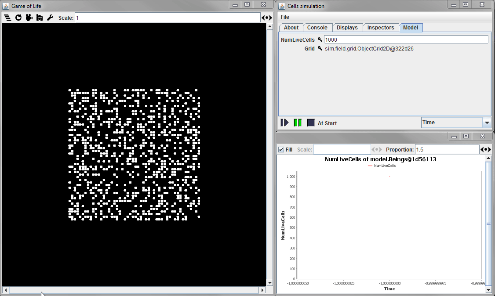

# Conway's Game of Life

A very naive and highly unoptimized implementation of [Conway's Game of Life](http://www.conwaylife.com/wiki/Conway's_Game_of_Life) in Java using [MASON](http://cs.gmu.edu/~eclab/projects/mason/).

>MASON is a fast discrete-event multiagent simulation library core in Java, designed to be the foundation for large custom-purpose Java simulations, and also to provide more than enough functionality for many lightweight simulation needs. MASON contains both a model library and an optional suite of visualization tools in 2D and 3D.

